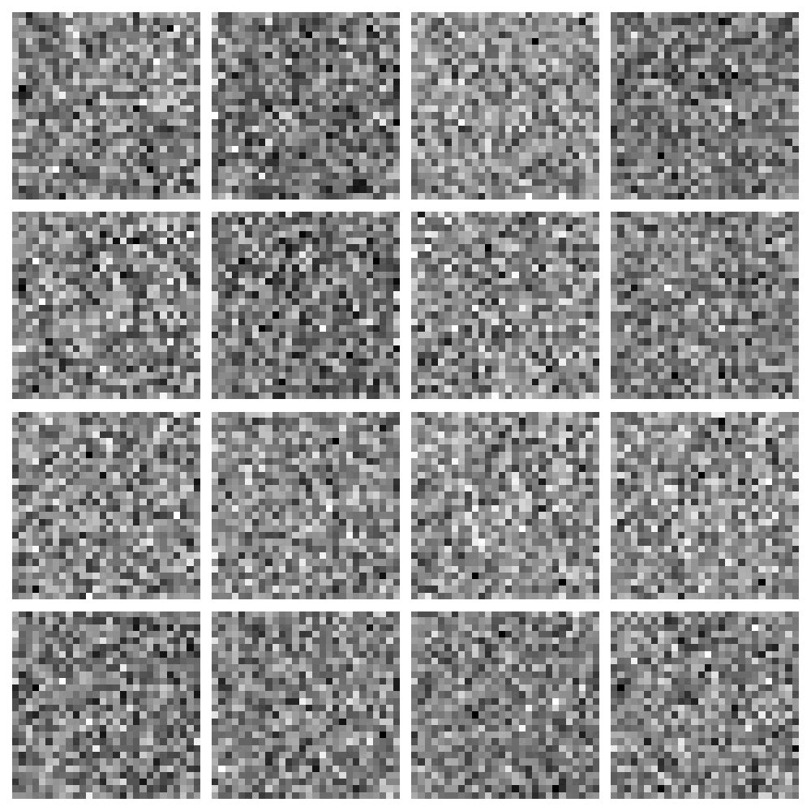

# 🧠 GAN Handwritten Digit Generator


## 📝 Project Overview

This project implements a **Generative Adversarial Network (GAN)** that generates high-quality handwritten digits based on single-digit text input. The model was trained on the **MNIST dataset** with a total of **2.4 million parameters**.

### 🚀 Key Features
- **Discriminator**: 1.5M+ parameters
- **Generator**: Nearly 1M parameters
- **Total Parameters**: 2.4M
- **Dataset**: MNIST (60,000 images, 28x28 size)
- **Optimizer**: Adam (learning rate: 0.002)
- **Training**: 50,000 epochs
- **Hardware**: Trained locally on a **GeForce RTX 4060 (8GB RAM)** GPU

### 🎯 Loss During Training
- **Initial Loss**: 0.6 for both discriminator and generator
- **Final Loss**: 0.6 for discriminator and 2.1 for generator
- Despite the increase in generator loss, the image quality improved **drastically** over the course of training.

## 📸 Generated Images

Here are some sample images generated by the GAN:




## 📂 Project Structure

```plaintext
├── data/                   # MNIST dataset
├── models/                 # Saved models
├── outputs/                # Generated images
├── train.py                # Script to train the GAN
├── generate.py             # Script to generate images from digit text
├── README.md               # Project README
└── requirements.txt        # Required libraries
